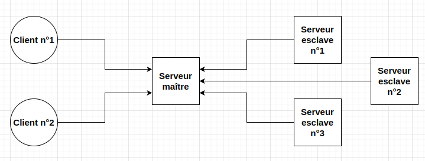

# Guide d'installation

## Prérequis
**Pour s'assurer que le projet fonctionne correctement, il est nécessaire d'être sous un système d'exploitation Linux (Ubuntu, Debian, Fedora, ...).**

Le projet nécessite l'installation d'au moins un client, d'un serveur maître et d'au moins un serveur esclave. Les dossiers "client", "main_server" et "slave_server" contiennent respectivement le code à lancer pour un client, pour le serveur maître et pour un serveur esclave.

Chaque élément peut être exécuté sur le même ordinateur/serveur, mais chaque programme doit être lancé dans un terminal différent.

⚠️ Attention, pour l'installation de plusieurs clients ou plusieurs serveurs esclaves sur la même machine, il faut les placer dans deux répertoires différents pour éviter que le dossier temporaire soit supprimé au lancement du 2ème client ou du 2ème serveur esclave.

## Procédure d'installation pour chaque élément
### Installation du serveur maître
Pour installer un serveur maître, il suffit de se rendre dans le dossier "main_server" et de faire la commande `python main.py --ip <ip> --port <port> --max-process <nombre_de_processus_maximum_pouvant_être_exécutés>`. L'adresse IP et le port sur lequel le serveur maître écoutera (mettre comme adresse IP "0.0.0.0" et comme port "10000" afin que le serveur maître écoute toutes les connexions sur le port 10000).

### Installation d'un client
Pour installer un client, il suffit de se rendre dans le dossier "client" et de faire la commande `python main.py --ip <ip> --port <port>`. L'adresse IP et le port du serveur maître doivent être renseignés (⚠️ le serveur maître doit être démarré avant le client).

### Installation d'un serveur esclave
Pour installer un serveur esclave, il suffit de se rendre dans le dossier "slave_server" et de faire la commande `python main.py --ip <ip> --port <port>`. L'adresse IP et le port du serveur maître doivent être renseignés (⚠️ le serveur maître doit être démarré avant le serveur esclave).

## Utilisation
Une fois les différents composants installés, il est possible de lancer des programmes depuis l'interface du client en cliquant sur "sélectionner un fichier à envoyer" et choisir le fichier à envoyer.
Attention, pour que le serveur esclave puisse exécuter les différents langages, il faut pouvoir exécuter les commandes python3 pour le Python, java pour le Java, gcc pour le C et g++ pour le C++.