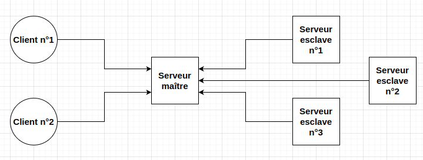

# Document de réflexion / réponse

## Fonctionnalités implémentées
- Historique des programmes exécutés, si on double-clique dans la liste, on peut voir le résultat du programme ainsi que l'UID du serveur esclave qui l'a exécuté.
- Possibilité de lancer des programmes en parallèle dans la limite du nombre de processus défini sur le serveur maître.
- Affichage du status dans la liste (✅ si le programme a été exécuté, ⏳ si le programme est en cours d'exécution, ❌ si le programme a échoué).
- Avoir la liste des clients et des serveurs esclaves connectés.
- Possibilité de connecter plusieurs clients au serveur maître.
- Répartition de la charge en fonction du nombre de processus en cours sur les différents serveurs esclaves.
- Gestion des erreurs lors de l'exécution d'un programme n'étant pas supporté par le serveur esclave ou contenant une erreur de syntaxe.

## Architecture
Le projet comporte trois parties : un client, un serveur maître et des serveurs esclaves. Le client permet de lancer des programmes sur les serveurs esclaves via le serveur maître.
Sur une architecture, il peut y avoir qu'un seul serveur maître, mais plusieurs clients et plusieurs serveurs esclaves qui sont connectés au serveur maître.

Schéma type d'une architecture du projet :

## Documentation
La documentation est disponible dans le dossier `docs_sphinx/_build/html/index.html`.

La vidéo de démonstration est disponible [ici](https://youtu.be/ERxIVb-8QZY).

## Planning
- Début du projet : réflexion sur l'architecture du projet et sur les fonctionnalités à implémenter.
- Premier mois du projet (mi-novembre à mi-décembre) : peu d'avancement sur le projet contrairement à ce qui était prévu pour cause de difficultés à organiser mon temps en fonction des autres cours.
- Fin du projet (vacances de Noël) : avancement sur le projet, implémentation des fonctionnalités principales du sujet complet.

## Améliorations possibles
- Sécuriser le projet
  - Sécuriser les échanges entre les différentes parties du projet.
  - Ajouter un système de login pour les clients.
- Pouvoir modifier le code source du programme à exécuter directement depuis l'interface du client.
- Pouvoir exécuter des programmes dans d'autres langages (JS, Ruby, PowerShell, ...).
- Améliorer la structure du code qui est actuellement un peu brouillon.

## Conclusion + avis personnel
Le projet a été sympa à réaliser dû fait de la complexité et de la flexibilité du sujet où nous étions libre de réaliser comme on le voulait notre projet avec des fonctionnalités en plus si on le souhaitait.